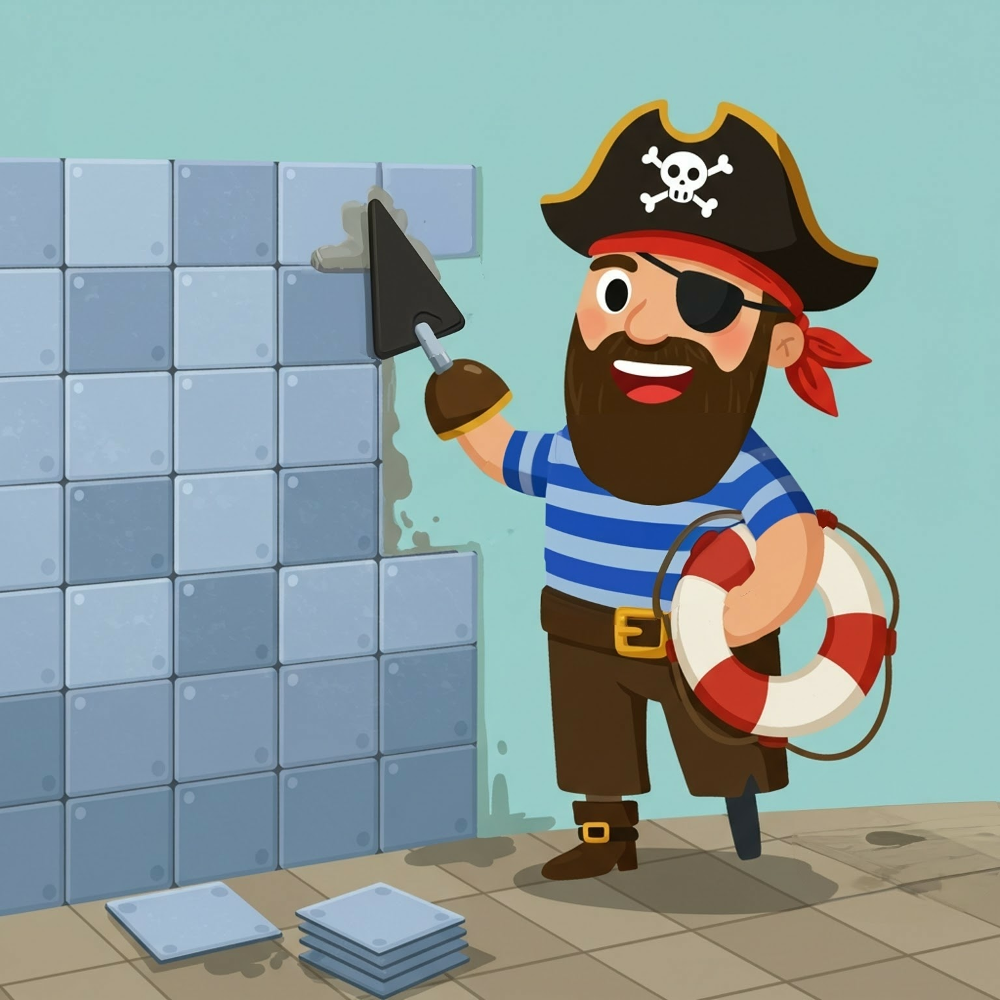

# pywet - Python Windows Emergency Tiler 

- 🏴‍☠️🐍💦🛟🪟
- A workflow centric windows tiling manager for Windows

## Image generation

- Tool: google image-fx (tried a bunch of tools, most refused to generate a hook-arm amputee pirate)
- Prompt: A 2D cartoonish pirate with an eye patch, wearing a striped shirt and a bandana, he is an amputee missing a hand, that hand is replaced by a pirate hook. He has a life-saver tucked under his arm. He is tiling a bathroom wall. The bathroom wall is partially tiled with blue tone tiles that make a beautiful pattern, and the pirate is happily working with a big smile. There is a stack of tiles on the floor yet to be tiled. The style is flat 2D, colorful, and playful, with clean lines and vibrant colors, creating a cheerful atmosphere. The pirate looks fun and friendly, enjoying his tiling task.
- Select hook for edit.
- Prompt: instead of a hook attachment, it should be a trowel attachment to fit the theme of a pirate tiling a bathroom wall. Do not try to generate hands, the pirate is an amputee and the trowel is a tool attachment for his stump.